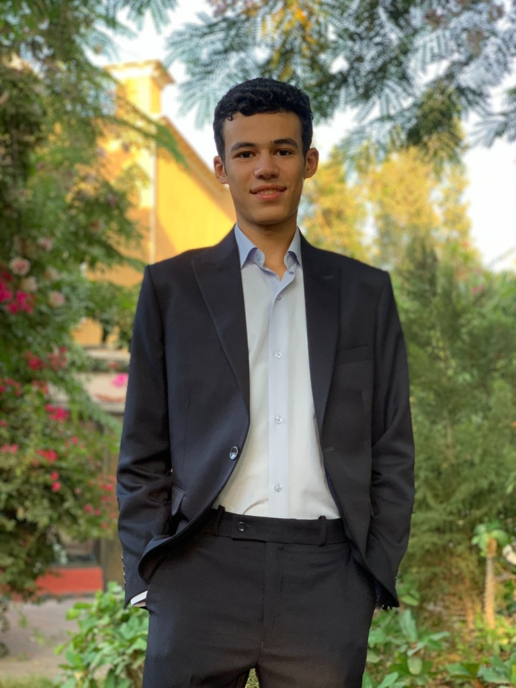

# Moaz Mohamed — Personal Portfolio Website

A clean, modern, and fully responsive personal developer portfolio website for **Moaz Mohamed Ibrahim**, a third-year Computer Science student at Helwan University specializing in Artificial Intelligence and exploring Data Science.



## 🚀 Key Features

- **Accurate Academic & Skill Representation**: Highlights status as a 3rd-year CS student at Helwan University specializing in AI without overstated titles or fake experience.
- **Real Profile Photo Integration**: Softly rounded image container powered by `/public/profile.jpg`.
- **4 University & Practical Projects**:
  1. *CPU Scheduling Simulator* (Python, Tkinter)
  2. *Java Management System* (Java, Java Swing, File Handling)
  3. *Jobify — University Career Fair Platform* (PHP, MySQL, HTML, CSS, XAMPP)
  4. *Hangman Game* (Python)
- **Categorized Skills**: Visual emphasis on **Python** for AI & Data Science, along with databases, tools, and CS fundamentals.
- **Currently Exploring Section**: Focused breakdown of AI, Data Science, and Computer Science learning goals.
- **Theme Toggle**: Dark mode by default with Light/Dark mode switcher persisted in `localStorage`.
- **Interactive Contact Form & Links**: Direct buttons for email, GitHub, and LinkedIn.
- **Fully Responsive & Accessible**: Built with semantic HTML, high contrast, clean keyboard navigation, and motion preference awareness.

---

## 🛠️ Built With

- **Framework**: [Vite](https://vitejs.dev/) + [React 18](https://react.dev/) + [TypeScript](https://www.typescriptlang.org/)
- **Styling**: [Tailwind CSS](https://tailwindcss.com/)
- **Icons**: [Lucide React](https://lucide.dev/)
- **Animations**: [Framer Motion](https://www.framer.com/motion/)

---

## 💻 Local Development Setup

### Prerequisites
- [Node.js](https://nodejs.org/) (v18.0.0 or higher recommended)
- [npm](https://www.npmjs.com/) or [pnpm](https://pnpm.io/) / [yarn](https://yarnpkg.com/)

### Installation Steps

1. **Clone the Repository**:
   ```bash
   git clone https://github.com/moaazElsakka/portfolio.git
   cd portfolio
   ```

2. **Install Dependencies**:
   ```bash
   npm install
   ```

3. **Start the Development Server**:
   ```bash
   npm run dev
   ```
   Open your browser and navigate to `http://localhost:5173`.

4. **Build for Production**:
   ```bash
   npm run build
   ```
   The compiled output will be generated inside the `dist/` directory.

---

## 📸 Profile Photo Setup

Your profile photo is located at:
```
public/profile.jpg
```
To update your photo in the future, simply replace `public/profile.jpg` with any image of your choice. No code modifications are required.

---

## 🔗 Customizing Personal & Project Links

All personal details, URLs, skill categories, and project definitions are centrally organized inside:
```
src/data/portfolioData.ts
```

- **Email**: Update `PERSONAL_INFO.email` (`moazmohamed019@gmail.com`)
- **GitHub**: Update `PERSONAL_INFO.github` (`https://github.com/moaazElsakka`)
- **LinkedIn**: Update `PERSONAL_INFO.linkedin` (`https://www.linkedin.com/in/moaaz-muhamed`)
- **Projects**: Update `PROJECTS` array with specific repository URLs.

---

## 📦 Uploading to GitHub

1. **Initialize Git (if not already done)**:
   ```bash
   git init
   git add .
   git commit -m "Initial commit: Moaz Mohamed Personal Portfolio Website"
   ```

2. **Connect Remote Repository & Push**:
   ```bash
   git remote add origin https://github.com/moaazElsakka/portfolio.git
   git branch -M main
   git push -u origin main
   ```

---

## 📄 License

This project is open source and available under the [MIT License](LICENSE).
